# Cerberus - Internal Developer Platform

<div align="center">

**Unleashing the Full Potential of Every Venture**

[](LICENSE)
[](https://aws.amazon.com/eks/)
[](https://argo-cd.readthedocs.io/)
[](https://opentofu.org/)

*From idea to production in hours, not weeks*

[Get Started](https://github.com/cerberus-platform-mop/cerberus) • [Documentation](https://github.com/cerberus-platform-mop/cerberus/tree/main/_workspace) • [Architecture](https://github.com/cerberus-platform-mop/cerberus/blob/main/_workspace/cerberus-technical-architecture.md)

</div>

---

## 🎯 What is Cerberus?

**Cerberus** is a unified, multi-tenant Internal Developer Platform (IDP) designed specifically for venture studio operations. Built on modern cloud-native technologies, it empowers engineering teams to deploy and manage infrastructure with confidence, enabling **92% reduction in lead time** for new features and services—from 2-4 days down to 2-4 hours.

### ⚡ Why Cerberus?

We believe that every startup deserves to focus on what makes them unique—their vision, their customers, their breakthrough ideas. Not on solving the same engineering problems that have been solved many times before.

**The Problem:**
- Too many brilliant entrepreneurs spend weeks wrestling with deployment pipelines
- Security configurations become blockers instead of enablers
- Identical features are rebuilt across projects
- Innovation is strangled by "undifferentiated heavy lifting"

**The Solution:**
Cerberus provides **Golden Paths**—pre-configured, battle-tested templates that embody years of best practices. Developers go from "I have an idea" to "I have a running service" in under one hour.


---

## 🏗️ Platform Architecture

### Core Technology Stack

```mermaid
graph TB
    Portal[Developer Portal<br/>GetPort.io<br/><i>Service Catalog • Golden Paths • Self-Service</i>]

    CICD[CI/CD<br/>GitHub Actions<br/>GitOps/ArgoCD]
    IaC[Infrastructure<br/>OpenTofu/Terragrunt<br/>Multi-Tenant]
    K8s[Kubernetes<br/>AWS EKS<br/>Multi-Tenant]

    Observability[Observability & Security<br/>Prometheus • Grafana • OpenTelemetry<br/>Fluent Bit • Vault • Falco]

    Portal --> CICD
    Portal --> IaC
    Portal --> K8s

    CICD --> Observability
    IaC --> Observability
    K8s --> Observability

    style Portal fill:#1a73e8,stroke:#1558b0,stroke-width:2px,color:#fff
    style CICD fill:#34a853,stroke:#2d8e47,stroke-width:2px,color:#fff
    style IaC fill:#ea4335,stroke:#c5392b,stroke-width:2px,color:#fff
    style K8s fill:#fbbc04,stroke:#d69e03,stroke-width:2px,color:#fff
    style Observability fill:#5f6368,stroke:#4d4f52,stroke-width:2px,color:#fff
```



### 🌟 Key Features

- **🎯 Golden Path Templates**: Pre-built, tested infrastructure templates for common patterns
- **🚀 Self-Service Portal**: Single interface for service discovery, deployment, and monitoring
- **🔒 Security by Default**: Built-in security scanning, policy enforcement, and compliance
- **📊 Enterprise Observability**: Centralized logging, metrics, and distributed tracing
- **🔄 GitOps Workflows**: Declarative deployments with ArgoCD
- **🤖 AI-Enhanced Development**: Cursor rules-based standardization for consistent code generation
- **🏢 Multi-Tenant Architecture**: Complete isolation with shared infrastructure efficiency
- **📦 Portable by Design**: Clean detachment when ventures graduate

---

## 🚀 Quick Start

### Prerequisites

```bash
# Install required tools (macOS)
brew install gh terraform opentofu terragrunt kubectl

# Authenticate with GitHub
gh auth login
```

### Clone the Platform Workspace

```bash
# Clone main repository
git clone git@github.com:cerberus-platform-mop/cerberus.git
cd cerberus

# Run automated workspace setup (clones all components)
cat README.md
```

---

## 📦 Platform Components

Cerberus is organized into domain-specific repositories:

### 🔧 AWS Account Factory (AFT)
Automated AWS account provisioning and management using AWS Control Tower.

- [`aft-account-request`](https://github.com/cerberus-platform-mop/aft-account-request) - Account provisioning definitions
- [`aft-account-customizations`](https://github.com/cerberus-platform-mop/aft-account-customizations) - Account-specific configurations
- [`aft-global-customizations`](https://github.com/cerberus-platform-mop/aft-global-customizations) - Organization-wide settings

### 🏗️ Infrastructure as Code (IaC)
OpenTofu/Terragrunt modules and live infrastructure configurations.

- [`platform-iac-catalog`](https://github.com/cerberus-platform-mop/platform-iac-catalog) - Reusable infrastructure modules
- [`platform-iac-live`](https://github.com/cerberus-platform-mop/platform-iac-live) - Environment-specific deployments

### ⚙️ CI/CD Automation
Reusable GitHub Actions workflows and templates.

- [`gha-templates-iac`](https://github.com/cerberus-platform-mop/gha-templates-iac) - IaC workflow templates
- [`gha-action-semver`](https://github.com/cerberus-platform-mop/gha-action-semver) - Semantic versioning automation

### ☸️ Kubernetes & GitOps
Kubernetes configurations and GitOps deployments.

- [`platform-k8s-dev-live`](https://github.com/cerberus-platform-mop/platform-k8s-dev-live) - Development cluster configurations
- ArgoCD-based continuous delivery

---

## 🎭 Role-Based Navigation

### 👷 Platform Engineers
Build and maintain the core platform infrastructure.

**Start Here:**
- [Platform Architecture](https://github.com/cerberus-platform-mop/cerberus/blob/main/_workspace/cerberus-technical-architecture.md)
- [Workspace Setup Guide](https://github.com/cerberus-platform-mop/cerberus/blob/main/_workspace/guides/workspace-setup-guide.md)
- AFT Components (AWS Account Factory)

### 🔧 DevOps Engineers
Design and implement CI/CD pipelines and automation.

**Start Here:**
- [CI/CD Overview](https://github.com/cerberus-platform-mop/cerberus/blob/main/_workspace/guides/ci-cd-overview.md)
- [GitHub Actions Guide](https://github.com/cerberus-platform-mop/cerberus/blob/main/_workspace/guides/github-actions-guide.md)
- CI/CD Components

### 🏗️ Infrastructure Engineers
Build infrastructure modules and manage deployments.

**Start Here:**
- [IaC Catalog Guide](https://github.com/cerberus-platform-mop/cerberus/blob/main/_workspace/guides/iac-catalog-guide.md)
- [Terragrunt Documentation](https://github.com/cerberus-platform-mop/cerberus/blob/main/_workspace/guides/terragrunt-docs.md)
- IaC Components

### ☸️ Kubernetes Engineers
Manage Kubernetes clusters and GitOps workflows.

**Start Here:**
- [Kubernetes Overview](https://github.com/cerberus-platform-mop/cerberus/blob/main/_workspace/guides/kubernetes-overview.md)
- [GitOps Guide](https://github.com/cerberus-platform-mop/cerberus/blob/main/_workspace/guides/gitops-guide.md)
- K8s Components

---

## 📚 Documentation

### 📖 Essential Reading
- [Why Cerberus?](https://github.com/cerberus-platform-mop/cerberus/blob/main/_workspace/why-cerberus.md) - Platform philosophy and goals
- [Technical Architecture](https://github.com/cerberus-platform-mop/cerberus/blob/main/_workspace/cerberus-technical-architecture.md) - Comprehensive technical design
- [Architecture Decision Records](https://github.com/cerberus-platform-mop/cerberus/tree/main/_workspace/decisions) - Key architectural decisions

### 🎓 Learning Resources
- [New Engineer Onboarding](https://github.com/cerberus-platform-mop/cerberus/blob/main/_workspace/onboarding/new-engineer-onboarding.md)
- [Quick Start Guides](https://github.com/cerberus-platform-mop/cerberus/blob/main/_workspace/onboarding/quick-start-guides.md)
- [Implementation Guides](https://github.com/cerberus-platform-mop/cerberus/tree/main/_workspace/guides)

### 🔧 Technical Guides
- [IaC Catalog Template Guide](https://github.com/cerberus-platform-mop/cerberus/blob/main/_workspace/docs/iac-catalog-template-guide.md)
- [Repository Bootstrapping](https://github.com/cerberus-platform-mop/cerberus/blob/main/_workspace/docs/repository-bootstrapping-guide.md)
- [DNS Implementation Guide](https://github.com/cerberus-platform-mop/cerberus/blob/main/_workspace/docs/cerb3rus-dns-implementation-guide.md)

---

## 🛡️ Security

Security is a top priority for Cerberus. We implement security best practices at every layer:

- **🔒 Zero Trust Architecture**: mTLS, Network Policies, Pod Security Standards
- **🔐 Secrets Management**: HashiCorp Vault integration
- **🔍 Security Scanning**: SAST, DAST, SCA, container vulnerability scanning
- **📋 Compliance**: Built-in SOC2, GDPR, PCI-DSS compliance patterns
- **🚨 Runtime Security**: Falco for threat detection and response

**Found a security vulnerability?** Please see our [Security Policy](SECURITY.md) for responsible disclosure procedures.

---

## 🌐 Community & Support

### Get Help

- **📚 Documentation**: Check our comprehensive docs in the main repository
- **💬 Discussions**: Join conversations in GitHub Discussions
- **🐛 Issues**: Report bugs or request features via GitHub Issues
- **📧 Email**: Contact the Platform Engineering team

### Stay Connected

- **GitHub Organization**: [@cerberus-platform-mop](https://github.com/cerberus-platform-mop)
- **Main Repository**: [cerberus](https://github.com/cerberus-platform-mop/cerberus)

---

## 🙏 Acknowledgments

Cerberus is built on the shoulders of giants. We're grateful to the open source community and these amazing projects:

- [Kubernetes](https://kubernetes.io/) - Container orchestration
- [ArgoCD](https://argo-cd.readthedocs.io/) - GitOps continuous delivery
- [OpenTofu](https://opentofu.org/) - Infrastructure as Code
- [GetPort.io](https://www.getport.io/) - Developer portal
- [Prometheus](https://prometheus.io/) & [Grafana](https://grafana.com/) - Observability
- And many more...

---

<div align="center">

**Built with ❤️ by the Ministry of Programming Platform Engineering Team**

*Empowering ventures to build the future, faster*

[Get Started](https://github.com/cerberus-platform-mop/cerberus) • [Documentation](https://github.com/cerberus-platform-mop/cerberus/tree/main/_workspace)

</div>

